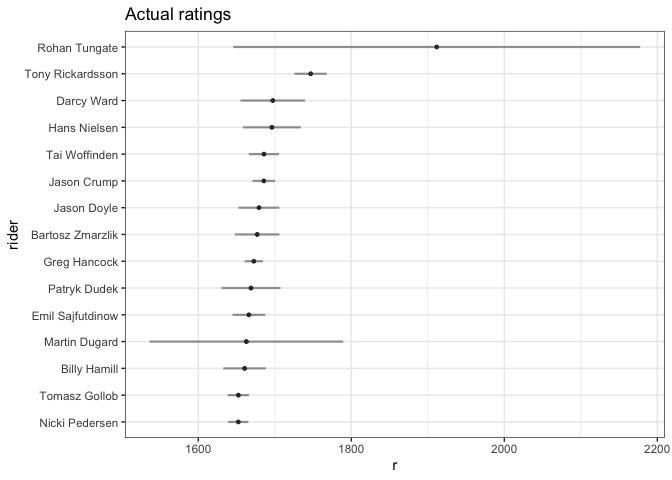
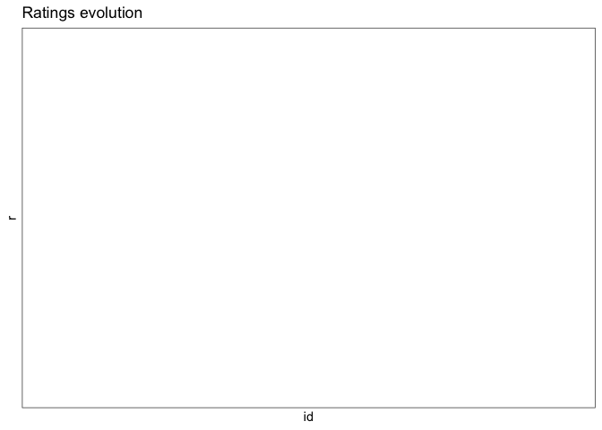

`sport` an R package for online update algorithms
================

[](https://travis-ci.org/gogonzo/sport) [](http://www.repostatus.org/#active) [](https://www.gnu.org/licenses/old-licenses/gpl-2.0.en.html) [](https://codecov.io/github/gogonzo/sport?branch=master)

About
=====

Package contains functions calculating ratings for two-player or multi-player matchups. Methods included in package are able to estimate ratings (players strengths) and their evolution in time, also able to predict output of challenge. Algorithms are based on Bayesian Approximation Method, and they don't involve any matrix inversions nor likelihood estimation. Weights (parameters) are updated sequentially, and computation doesn't require any additional RAM to make estimation feasible. Additionally, base of the package is written in `C++` what makes `sport` computation even faster.

Theory
======

Problem of sport matchups falls into subject of paired comparison modeling and choice modeling. Estimating player skills is equivalent to estimating preference of choice between two alternatives. Just as one product is more preferred over another to buy, similarly better player is more preferred to win over worst. As player/event and alternative/experiment can be used interchangeably, for ease of use sport nomenclature is adapted (player/event).

Algorithms implemented in a `sport` package works similarly, as all using Bayesian Approximation Method. Algorithms works as follows: At the moment player `i` competes with player `j` while both have initial  and  ratings. Prior to event, probability that player `i` win over player `j` is . After event is finished when true result  is observed, initial believe about rating is changed  according to the prediction error ") and some constant . Updates are summed as player can compete with more than one player in particular event.

")

 Where:

")


Outcome probability function is based on [Bradley-Terry model](https://en.wikipedia.org/wiki/Bradley%E2%80%93Terry_model) designed to predict outcome of pairwise comparison. For multi-player matchups where output is a ranking, `sport` package uses the same data transformation as in [exploded logit](https://www.jstor.org/stable/270983) - ranking is then presented as combination of all possible pairs competing within same event.

Glicko rating system
--------------------

Glicko is the first bayesian online update algorithm incorporating rating volatility to rating and outcome computation. Glicko system is not balanced, and sum of rating rewards of all players are not zero. In one 2-players event, reward of player `i` differs from reward of player `q` as it depends on their individual ratings deviation. Rating values oscillates around `r=1500` with max deviation `rd<=350`.

For deeper knowledge read [Mark E. Glickman (1999)](http://www.glicko.net/research/glicko.pdf).

Update Rules:

 = \frac{1}{ 1 + 10^{-g(RD_{ij}) * (R_i-R_j)/400}}")

 * (Y_{ij} - \hat{Y_{ij}})  }")

^{-1}")

Glicko2 rating system
---------------------

Glicko2 improved predecessor by adding volatile parameter  which increase/decrease rating deviation in periods when player performance differs from expected. Sigma is estimated iteratively using Illinois algorithm, which converges quickly not affecting computation time. Rating values oscillates around `r=1500` with max deviation `rd<=350`.

For further knowledge read [Mark E. Glickman (2013)](http://www.glicko.net/glicko/glicko2.pdf)

*(\mu_i  - \mu_j)} }")


*(Y_{ij} - \hat{Y_{ij}})} ")

Bayesian Bradley Terry
----------------------

The fastest algorithm with simple formula. Original BT formula lacks variance parameter, and this method incorporates rating deviation into model. BBT also prevents against fast `rd` decline to zero using `gamma` and `kappa`.

For further knowledge read [Ruby C. Weng and Chih-Jen Lin (2011)](http://jmlr.csail.mit.edu/papers/volume12/weng11a/weng11a.pdf)

 = \frac{e^{R_i/c_{i_j}}}{e^{R_i/c_{ij}} + e^{R_j/c_{ij}}} ")

}")

![{RD'}\_i = RD\_i \* \[ 1 - \\frac{RD\_{ij}^2}{RD\_i^2}\\sum\_j{ \\gamma\_j \* (\\frac{RD\_i}{c\_{ij}})^2\* \\hat{Y\_{ij}}\\hat{Y\_{ji}}   } \]](https://latex.codecogs.com/png.latex?%7BRD%27%7D_i%20%3D%20RD_i%20%2A%20%5B%201%20-%20%5Cfrac%7BRD_%7Bij%7D%5E2%7D%7BRD_i%5E2%7D%5Csum_j%7B%20%5Cgamma_j%20%2A%20%28%5Cfrac%7BRD_i%7D%7Bc_%7Bij%7D%7D%29%5E2%2A%20%5Chat%7BY_%7Bij%7D%7D%5Chat%7BY_%7Bji%7D%7D%20%20%20%7D%20%5D "{RD'}_i = RD_i * [ 1 - \frac{RD_{ij}^2}{RD_i^2}\sum_j{ \gamma_j * (\frac{RD_i}{c_{ij}})^2* \hat{Y_{ij}}\hat{Y_{ji}}   } ]")

Dynamic Bayesian Logit
----------------------

Following algorithm gives some advantages over mentioned rating systems, adding other important factors to estimation process making final ratings unbiased. Algorithm perform better in disciples where other variables can make a difference in result eg. home field advantage. DBL implements Extended Kalman Filter learning rule, and allows to estimate multiple parameters in addition to player ratings. DBL is a Dynamic Logit extended to usage in pairwise comparisons by modeling differences in players characteristics. Classic Bradley-Terry model is enriched by moderation element ") which adds prior uncertainty to output prediction.

w _t^T(x_{it}-x_{jt})} }{1+e^{-K(s_t)w _t^T(x_{it}-x_{jt})}}")

 Parameters for player `i` competing with player `j` are estimated using EKF update rule.

} + \frac{RD^2_{i(t-1)}}{1+\hat{Y_{ij}}  (1-\hat{Y_{ij}})}  x_t (Y_{ij} - \hat{Y_{ij}})")

} - \frac{\hat{Y_{ij}}(1-\hat{Y_{ij}})}{1+\hat{Y_{ij}}  (1-\hat{Y_{ij}})s_t^2}(RD^2_{i(t-1)}x_i)(RD^2_{i(t-1)}x_i)^T")

For further knowledge read [Stephen J. Roberts, William Penny (2011)](https://www.researchgate.net/publication/2465226_Dynamic_Logistic_Regression)

Package Usage
=============

Installation
------------

Install package from github.

``` r
# devtools::install_github("gogonzo/sport")
library(sport)
```

Available Data
--------------

Package contains actual data from Speedway Grand-Prix. There are two data.frames:

1.  `gpheats` - results SGP heats. Column `rank` is a numeric version of column `position` - rider position in race.
2.  `gpsquads` - summarized results of the events, with sum of point and final position.

``` r
str(gpheats)
#> 'data.frame':    20649 obs. of  11 variables:
#>  $ id      : num  1 1 1 1 2 2 2 2 3 3 ...
#>  $ season  : int  1995 1995 1995 1995 1995 1995 1995 1995 1995 1995 ...
#>  $ date    : POSIXct, format: "1995-05-20 19:00:00" "1995-05-20 19:00:00" ...
#>  $ round   : int  1 1 1 1 1 1 1 1 1 1 ...
#>  $ name    : chr  "Speedway Grand Prix of Poland" "Speedway Grand Prix of Poland" "Speedway Grand Prix of Poland" "Speedway Grand Prix of Poland" ...
#>  $ heat    : int  1 1 1 1 2 2 2 2 3 3 ...
#>  $ field   : int  1 2 3 4 1 2 3 4 1 2 ...
#>  $ rider   : chr  "Tomasz Gollob" "Gary Havelock" "Chris Louis" "Tony Rickardsson" ...
#>  $ points  : int  2 0 3 1 3 0 1 2 0 2 ...
#>  $ position: chr  "2" "4" "1" "3" ...
#>  $ rank    : num  2 4 1 3 1 4 3 2 4 2 ...
```

Data used in `sport` package must be in so called long format. Typically data.frame contains at least `id`, `name` and `rank`, with one row for one player within specific match. Package allows for any number of players within event and allows ties also. For all games, *output needs to be a rank/position in event*. Don't mix up rank output with typical 1-win, 0-lost. In `sport` package output for two player game is 1-winner 2-looser. Below example of two matches with 4 players each.

    #>   id             rider rank
    #> 1  1     Tomasz Gollob    2
    #> 2  1     Gary Havelock    4
    #> 3  1       Chris Louis    1
    #> 4  1  Tony Rickardsson    3
    #> 5  2     Sam Ermolenko    1
    #> 6  2    Jan Staechmann    4
    #> 7  2     Tommy Knudsen    3
    #> 8  2 Henrik Gustafsson    2

Estimate dynamic ratings
------------------------

To compute ratings using each algorithms one has to specify formula. Form `rank | id ~ name` is required, which estimates `name` - rating of a player, by observing outputs - `rank`, nested within particular event - `id`. Variable names in formula are unrestricted, but model structure remains the same. All methods are named `method_run`. `formula = rank|id ~ name`

``` r
glicko  <- glicko_run(  formula = rank|id ~ rider, data = gpheats )
#> r is missing and will set to default=1500
#> rd is missing and will set to default=350
glicko2 <- glicko2_run( formula = rank|id ~ rider, data = gpheats )
#> r is missing and will set to default=1500
#> rd is missing and will set to default=350
#> sigma is missing and will set to default=0.05
bbt     <- bbt_run(     formula = rank|id ~ rider, data = gpheats )
#> r is missing and will set to default=25
#> rd is missing and will set to default=8.33333333333333
dbl     <- dbl_run(     formula = rank|id ~ rider, data = gpheats )
print(dbl)
#> 
#> Call: rank | id ~ rider
#> 
#> Number of unique pairs: 31081
#> 
#> Accuracy of the model: 0.62
#> 
#> True probabilities and Accuracy in predicted intervals:
#>      Interval Model probability True probability Accuracy     n
#>  1:   [0,0.1]             0.076            0.164    0.835   436
#>  2: (0.1,0.2]             0.158            0.252    0.747  2217
#>  3: (0.2,0.3]             0.257            0.300    0.699  5447
#>  4: (0.3,0.4]             0.353            0.372    0.626 10113
#>  5: (0.4,0.5]             0.450            0.454    0.545 12911
#>  6: (0.5,0.6]             0.550            0.546    0.545 12825
#>  7: (0.6,0.7]             0.647            0.628    0.626 10113
#>  8: (0.7,0.8]             0.743            0.700    0.699  5447
#>  9: (0.8,0.9]             0.842            0.748    0.747  2217
#> 10:   (0.9,1]             0.924            0.836    0.835   436
```

Output
------

Objects returned by `method_run` are of class `rating` and have their own `print` `summary` which provides most important informations. -`print.sport` shows condensed informations about model performance like accuracy and consistency of model predictions with observed probabilities. More profound summarization are given by `summary` by showing ratings, ratings deviations and comparing model win probabilities with observed.

``` r
summary(dbl)
#> $formula
#> rank | id ~ rider
#> 
#> $method
#> [1] "dbl"
#> 
#> $`Overall Accuracy`
#> [1] 0.6167273
#> 
#> $`Number of pairs`
#> [1] 62162
#> 
#> $r
#>                  name      r    rd Model probability True probability
#>   1:    Tomasz Gollob  1.329 0.005             0.572            0.587
#>   2:    Gary Havelock  0.696 0.111             0.410            0.476
#>   3:      Chris Louis  0.205 0.023             0.523            0.505
#>   4: Tony Rickardsson  1.793 0.012             0.684            0.703
#>   5:    Sam Ermolenko  0.552 0.064             0.534            0.546
#>  ---                                                                 
#> 209:   Justin Sedgmen -0.508 0.511             0.347            0.267
#> 210:    Rohan Tungate  2.880 0.712             0.537            1.000
#> 211:    Maksym Drabik  0.693 0.731             0.297            0.429
#> 212:       Dan Bewley -0.271 0.837             0.307            0.250
#> 213:       Joel Kling  0.644 0.831             0.305            0.500
#>      Accuracy pairings
#>   1:    0.591     2718
#>   2:    0.659      126
#>   3:    0.580      605
#>   4:    0.699     1313
#>   5:    0.523      216
#>  ---                  
#> 209:    0.800       15
#> 210:    0.625        8
#> 211:    0.714        7
#> 212:    0.750        4
#> 213:    0.500        4
```

To visualize top n ratings with their 95% confidence interval one can use dedicated `plot.rating` function. For "bdl" method top coefficients are presented not necessarily ratings. It's also possible to examine ratings evolution in time, by specifying `players` argument.

``` r
plot(glicko, n=15)
```



``` r
plot(glicko, players = c("Greg Hancock","Nicki Pedersen","Jason Crump"))
```



Except dedicated `print`,`summary` and `plot` there is possibility to extract more detailed information to be analyzed. `rating` object contains following elements:

``` r
names(glicko)
#> [1] "final_r"  "final_rd" "r"        "pairs"
```

-   `rating$final_r` and `rating$final_rd` contains ratings and ratings deviations estimations.
-   `r` contains data.frame with sequential ratings estimations from first event to the last. Number of rows in `r` equals number of rows in input data.
-   `pairs` pairwise combinations of players in analyzed events with prior probability and result of a challenge.

``` r
tail(glicko$r)
#>      id             name        r        rd
#> 1: 5154   Martin Vaculik 1556.186 15.598332
#> 2: 5154     Patryk Dudek 1668.852 19.472240
#> 3: 5155      Matej Žagar 1587.954  9.007093
#> 4: 5155 Fredrik Lindgren 1588.903  8.318461
#> 5: 5155   Martin Vaculik 1554.414 15.552804
#> 6: 5155   Nicki Pedersen 1652.299  6.677019
tail(glicko$pairs)
#>      id           name         opponent         P Y
#> 1: 5155 Martin Vaculik      Matej Žagar 0.4548475 0
#> 2: 5155 Martin Vaculik Fredrik Lindgren 0.4528676 0
#> 3: 5155 Martin Vaculik   Nicki Pedersen 0.3656971 0
#> 4: 5155 Nicki Pedersen      Matej Žagar 0.5914313 1
#> 5: 5155 Nicki Pedersen Fredrik Lindgren 0.5895059 1
#> 6: 5155 Nicki Pedersen   Martin Vaculik 0.6343029 1
```
