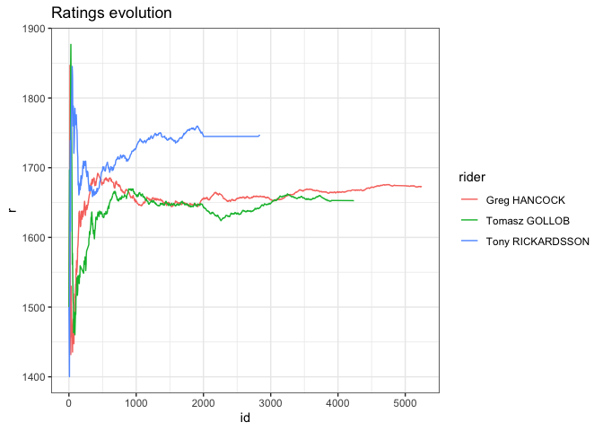

`sport` an R package for Online Ranking Methods
================

# sport 

<div id="badges">

[](https://cran.r-project.org/web/packages/sport/index.html)
[](https://travis-ci.org/gogonzo/sport)
[](https://ci.appveyor.com/project/gogonzo/sport)
[](https://www.gnu.org/licenses/old-licenses/gpl-2.0.html)
[](https://codecov.io/gh/gogonzo/sport)

</div>

# About

Name `sport` is an abbreviation for Sequential Pairwise Online Rating
Techniques. Package contains functions calculating ratings for
two-player or multi-player matchups. Methods included in package are
able to estimate ratings (players strengths) and their evolution in
time, also able to predict output of challenge. Algorithms are based on
Bayesian Approximation Method, and they don’t involve any matrix
inversions nor likelihood estimation. `sport` incorporates methods such
glicko, glicko2, bayesian Bradley-Terry, dynamic logistic regression.
Parameters are updated sequentially, and computation doesn’t require any
additional RAM to make estimation feasible. Additionally, base of the
package is written in `C++` what makes `sport` computation even faster.

# Package Usage

## Installation

Install package from CRAN or development version from github.

``` r
devtools::install_github("gogonzo/sport")
install.packages("sport",repos = "https://cloud.r-project.org/")
```

## Available Data

Package contains actual data from Speedway Grand-Prix. There are two
data.frames:

1.  `gpheats` - results SGP heats. Column `rank` is a numeric version of
    column `position` - rider position in race.
2.  `gpsquads` - summarized results of the events, with sum of point and
    final position.

<!-- end list -->

``` r
library(sport) 
str(gpheats)
#> 'data.frame':    20649 obs. of  11 variables:
#>  $ id      : num  1 1 1 1 2 2 2 2 3 3 ...
#>  $ season  : int  1995 1995 1995 1995 1995 1995 1995 1995 1995 1995 ...
#>  $ date    : POSIXct, format: "1995-05-20 19:00:00" "1995-05-20 19:00:00" ...
#>  $ round   : int  1 1 1 1 1 1 1 1 1 1 ...
#>  $ name    : chr  "Speedway Grand Prix of Poland" "Speedway Grand Prix of Poland" "Speedway Grand Prix of Poland" "Speedway Grand Prix of Poland" ...
#>  $ heat    : int  1 1 1 1 2 2 2 2 3 3 ...
#>  $ field   : int  1 2 3 4 1 2 3 4 1 2 ...
#>  $ rider   : chr  "Tomasz Gollob" "Gary Havelock" "Chris Louis" "Tony Rickardsson" ...
#>  $ points  : int  2 0 3 1 3 0 1 2 0 2 ...
#>  $ position: chr  "2" "4" "1" "3" ...
#>  $ rank    : num  2 4 1 3 1 4 3 2 4 2 ...
```

Data used in `sport` package must be in so called long format. Typically
data.frame contains at least `id`, `name` and `rank`, with one row for
one player within specific match. Package allows for any number of
players within event and allows ties also. For all games, *output needs
to be a rank/position in event*. Don’t mix up rank output with typical
1-win, 0-lost. In `sport` package output for two player game is 1-winner
2-looser. Below example of two matches with 4 players each.

    #>   id             rider rank
    #> 1  1     Tomasz Gollob    2
    #> 2  1     Gary Havelock    4
    #> 3  1       Chris Louis    1
    #> 4  1  Tony Rickardsson    3
    #> 5  2     Sam Ermolenko    1
    #> 6  2    Jan Staechmann    4
    #> 7  2     Tommy Knudsen    3
    #> 8  2 Henrik Gustafsson    2

## Estimate dynamic ratings

To compute ratings using each algorithms one has to specify formula.
Form `rank | id ~ name` is required, which estimates `name` - rating of
a player, by observing outputs - `rank`, nested within particular event
- `id`. Variable names in formula are unrestricted, but model structure
remains the same. All methods are named `method_run`. `formula = rank|id
~ name`

``` r
glicko  <- glicko_run(formula = rank|id ~ player(rider), data = gpheats)
glicko2 <- glicko2_run(formula = rank|id ~ player(rider), data = gpheats)
bbt     <- bbt_run(formula = rank|id ~ player(rider), data = gpheats)
dbl     <- dbl_run(formula = rank|id ~ player(rider), data = gpheats)

print(dbl)
#> 
#> Call: rank | id ~ player(rider)
#> 
#> Number of unique pairs: 31081
#> 
#> Accuracy of the model: 0.61
#> 
#> True probabilities and Accuracy in predicted intervals:
#>      Interval Model probability True probability Accuracy     n
#>  1:   [0,0.1]             0.074            0.211    0.788   538
#>  2: (0.1,0.2]             0.156            0.264    0.735  2109
#>  3: (0.2,0.3]             0.258            0.315    0.684  4998
#>  4: (0.3,0.4]             0.353            0.378    0.620 10247
#>  5: (0.4,0.5]             0.451            0.458    0.540 13232
#>  6: (0.5,0.6]             0.550            0.542    0.541 13146
#>  7: (0.6,0.7]             0.647            0.622    0.620 10247
#>  8: (0.7,0.8]             0.742            0.685    0.684  4998
#>  9: (0.8,0.9]             0.844            0.736    0.735  2109
#> 10:   (0.9,1]             0.926            0.789    0.788   538
```

## Output

Objects returned by `method_run` are of class `rating` and have their
own `print` `summary` which provides most important informations.
-`print.sport` shows condensed informations about model performance like
accuracy and consistency of model predictions with observed
probabilities. More profound summary are given by `summary` by showing
ratings, ratings deviations and comparing model win probabilities with
observed.

``` r
summary(dbl)
#> $formula
#> rank | id ~ player(rider)
#> 
#> $method
#> [1] "dbl"
#> 
#> $`Overall Accuracy`
#> [1] 0.6073003
#> 
#> $`Number of pairs`
#> [1] 62162
#> 
#> $r
#>                       rider      r    rd
#>   1:    rider=Tomasz Gollob  0.966 0.002
#>   2:    rider=Gary Havelock  0.865 0.116
#>   3:      rider=Chris Louis  0.351 0.009
#>   4: rider=Tony Rickardsson  1.516 0.004
#>   5:    rider=Sam Ermolenko  0.479 0.037
#>  ---                                    
#> 209:   rider=Justin Sedgmen -1.214 0.774
#> 210:    rider=Rohan Tungate  2.688 0.902
#> 211:    rider=Maksym Drabik  0.341 0.902
#> 212:       rider=Dan Bewley -0.495 0.950
#> 213:       rider=Joel Kling  0.351 0.950
```

To visualize top n ratings with their 95% confidence interval one can
use dedicated `plot.rating` function. For DBL method top coefficients
are presented not necessarily ratings. It’s also possible to examine
ratings evolution in time, by specifying `players` argument.

<div class="col2">

``` r
plot(glicko, n = 15)
```

<!-- -->

``` r
plot(glicko, 
     players = c("Greg Hancock","Nicki Pedersen","Jason Crump"))
```

<!-- -->

</div>

Except dedicated `print`,`summary` and `plot` there is possibility to
extract more detailed information to be analyzed. `rating` object
contains following elements:

``` r
names(glicko)
#> [1] "final_r"  "final_rd" "r"        "pairs"
```

  - `rating$final_r` and `rating$final_rd` contains ratings and ratings
    deviations estimations.
  - `r` contains data.frame with sequential ratings estimations from
    first event to the last. Number of rows in `r` equals number of rows
    in input data.
  - `pairs` pairwise combinations of players in analyzed events with
    prior probability and result of a challenge.

<!-- end list -->

``` r
tail(glicko$r)
#>      id            rider        r        rd
#> 1: 5154   Martin Vaculik 1555.046 15.643086
#> 2: 5154     Patryk Dudek 1670.666 19.559234
#> 3: 5155      Matej Žagar 1587.699  9.016050
#> 4: 5155 Fredrik Lindgren 1589.087  8.325517
#> 5: 5155   Martin Vaculik 1556.186 15.598332
#> 6: 5155   Nicki Pedersen 1651.995  6.680547
tail(glicko$pairs)
#>      id          rider         opponent Y         P
#> 1: 5155 Martin Vaculik      Matej Žagar 0 0.4548475
#> 2: 5155 Martin Vaculik Fredrik Lindgren 0 0.4528676
#> 3: 5155 Martin Vaculik   Nicki Pedersen 0 0.3656971
#> 4: 5155 Nicki Pedersen      Matej Žagar 1 0.5914313
#> 5: 5155 Nicki Pedersen Fredrik Lindgren 1 0.5895059
#> 6: 5155 Nicki Pedersen   Martin Vaculik 1 0.6343029
```
