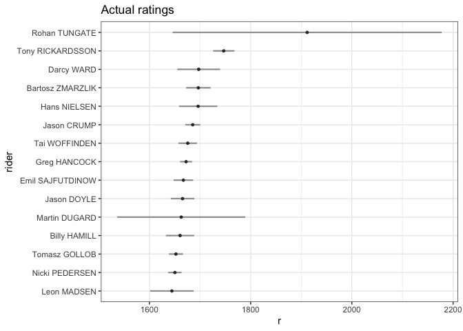

`sport` an R package for Online Ranking Methods
================

# sport 

<!-- badges: start -->

[](https://cran.r-project.org/web/packages/sport/index.html)
[](https://travis-ci.org/gogonzo/sport)
[](https://ci.appveyor.com/project/gogonzo/sport)
[](https://www.gnu.org/licenses/old-licenses/gpl-2.0.html)
[](https://codecov.io/gh/gogonzo/sport)
<!-- badges: end -->

# About

Name `sport` is an abbreviation for Sequential Pairwise Online Rating
Techniques. Package contains functions calculating ratings for
two-player or multi-player matchups. Methods included in package are
able to estimate ratings (players strengths) and their evolution in
time, also able to predict output of challenge. Algorithms are based on
Bayesian Approximation Method, and they don’t involve any matrix
inversions nor likelihood estimation. `sport` incorporates methods such
glicko, glicko2, bayesian Bradley-Terry, dynamic logistic regression.
Parameters are updated sequentially, and computation doesn’t require any
additional RAM to make estimation feasible. Additionally, base of the
package is written in `C++` what makes `sport` computation even faster.

# Package Usage

## Installation

Install package from CRAN or development version from github.

``` r
devtools::install_github("gogonzo/sport")
install.packages("sport",repos = "https://cloud.r-project.org/")
```

## Available Data

Package contains actual data from Speedway Grand-Prix. There are two
data.frames:

1.  `gpheats` - results SGP heats. Column `rank` is a numeric version of
    column `position` - rider position in race.
2.  `gpsquads` - summarized results of the events, with sum of point and
    final position.

<!-- end list -->

``` r
library(sport) 
str(gpheats)
#> 'data.frame':    21932 obs. of  11 variables:
#>  $ id      : num  1 1 1 1 2 2 2 2 3 3 ...
#>  $ season  : int  1995 1995 1995 1995 1995 1995 1995 1995 1995 1995 ...
#>  $ date    : POSIXct, format: "1995-05-20 19:00:00" "1995-05-20 19:00:00" ...
#>  $ round   : int  1 1 1 1 1 1 1 1 1 1 ...
#>  $ name    : chr  "Speedway Grand Prix of Poland" "Speedway Grand Prix of Poland" "Speedway Grand Prix of Poland" "Speedway Grand Prix of Poland" ...
#>  $ heat    : int  1 1 1 1 2 2 2 2 3 3 ...
#>  $ field   : int  1 2 3 4 1 2 3 4 1 2 ...
#>  $ rider   : chr  "Tomasz GOLLOB" "Gary HAVELOCK" "Chris LOUIS" "Tony RICKARDSSON" ...
#>  $ points  : int  2 0 3 1 3 0 1 2 0 2 ...
#>  $ position: chr  "2" "4" "1" "3" ...
#>  $ rank    : num  2 4 1 3 1 4 3 2 4 2 ...
```

Data used in `sport` package must be in so called long format. Typically
data.frame contains at least `id`, `name` and `rank`, with one row for
one player within specific match. Package allows for any number of
players within event and allows ties also. For all games, *output needs
to be a rank/position in event*. Don’t mix up rank output with typical
1-win, 0-lost. In `sport` package output for two player game is 1-winner
2-looser. Below example of two matches with 4 players each.

    #>   id             rider rank
    #> 1  1     Tomasz GOLLOB    2
    #> 2  1     Gary HAVELOCK    4
    #> 3  1       Chris LOUIS    1
    #> 4  1  Tony RICKARDSSON    3
    #> 5  2     Sam ERMOLENKO    1
    #> 6  2    Jan STAECHMANN    4
    #> 7  2     Tommy KNUDSEN    3
    #> 8  2 Henrik GUSTAFSSON    2

## Estimate dynamic ratings

To compute ratings using each algorithms one has to specify formula.
Form `rank | id ~ name` is required, which estimates `name` - rating of
a player, by observing outputs - `rank`, nested within particular event
- `id`. Variable names in formula are unrestricted, but model structure
remains the same. All methods are named `method_run`. `formula = rank|id
~ name`

``` r
glicko  <- glicko_run(formula = rank|id ~ player(rider), data = gpheats)
glicko2 <- glicko2_run(formula = rank|id ~ player(rider), data = gpheats)
bbt     <- bbt_run(formula = rank|id ~ player(rider), data = gpheats)
dbl     <- dbl_run(formula = rank|id ~ player(rider), data = gpheats)

print(dbl)
#> 
#> Call: rank | id ~ player(rider)
#> 
#> Number of unique pairs: 33003
#> 
#> Accuracy of the model: 0.61
#> 
#> True probabilities and Accuracy in predicted intervals:
#>      Interval Model probability True probability Accuracy     n
#>  1:   [0,0.1]             0.075            0.211    0.788   562
#>  2: (0.1,0.2]             0.156            0.258    0.741  2229
#>  3: (0.2,0.3]             0.258            0.316    0.683  5246
#>  4: (0.3,0.4]             0.354            0.379    0.619 10887
#>  5: (0.4,0.5]             0.451            0.460    0.539 14122
#>  6: (0.5,0.6]             0.549            0.540    0.539 14036
#>  7: (0.6,0.7]             0.646            0.621    0.619 10887
#>  8: (0.7,0.8]             0.742            0.684    0.683  5246
#>  9: (0.8,0.9]             0.844            0.742    0.741  2229
#> 10:   (0.9,1]             0.925            0.789    0.788   562
```

## Output

Objects returned by `method_run` are of class `rating` and have their
own `print` `summary` which provides most important informations.
-`print.sport` shows condensed informations about model performance like
accuracy and consistency of model predictions with observed
probabilities. More profound summary are given by `summary` by showing
ratings, ratings deviations and comparing model win probabilities with
observed.

``` r
summary(dbl)
#> $formula
#> rank | id ~ player(rider)
#> 
#> $method
#> [1] "dbl"
#> 
#> $`Overall Accuracy`
#> [1] 0.6062934
#> 
#> $`Number of pairs`
#> [1] 66006
#> 
#> $r
#>                            rider      r    rd
#>   1:         rider=Tomasz GOLLOB  0.965 0.002
#>   2:         rider=Gary HAVELOCK  0.865 0.116
#>   3:           rider=Chris LOUIS  0.351 0.009
#>   4:      rider=Tony RICKARDSSON  1.516 0.004
#>   5:         rider=Sam ERMOLENKO  0.479 0.037
#>  ---                                         
#> 213:        rider=Szymon WOŹNIAK  0.173 0.774
#> 214:        rider=Kevin WOELBERT  0.318 0.815
#> 215: rider=Igor KOPEĆ-SOBCZYŃSKI -0.377 0.950
#> 216:          rider=Zdenek HOLUB -0.409 0.950
#> 217:        rider=Charles WRIGHT -0.655 0.774
```

To visualize top n ratings with their 95% confidence interval one can
use dedicated `plot.rating` function. For DBL method top coefficients
are presented not necessarily ratings. It’s also possible to examine
ratings evolution in time, by specifying `players` argument.

``` r
plot(glicko, n = 15)
plot(glicko, 
     players = c("Greg HANCOCK","Tomasz GOLLOB","Tony RICKARDSSON"))
```



Except dedicated `print`,`summary` and `plot` there is possibility to
extract more detailed information to be analyzed. `rating` object
contains following elements:

``` r
names(glicko)
#> [1] "final_r"  "final_rd" "r"        "pairs"
```

  - `rating$final_r` and `rating$final_rd` contains ratings and ratings
    deviations estimations.
  - `r` contains data.frame with sequential ratings estimations from
    first event to the last. Number of rows in `r` equals number of rows
    in input data.
  - `pairs` pairwise combinations of players in analyzed events with
    prior probability and result of a challenge.

<!-- end list -->

``` r
tail(glicko$r)
#>      id                  rider        r        rd
#> 1: 5476       Fredrik LINDGREN 1595.713  7.815778
#> 2: 5476          Tai WOFFINDEN 1675.975  9.294484
#> 3: 5477            Leon MADSEN 1640.216 21.792118
#> 4: 5477       Bartosz ZMARZLIK 1698.159 12.272463
#> 5: 5477 Niels Kristian IVERSEN 1580.907  9.192937
#> 6: 5477       Emil SAJFUTDINOW 1666.851  9.764087
tail(glicko$pairs)
#>      id                  rider               opponent Y         P
#> 1: 5477 Niels Kristian IVERSEN            Leon MADSEN 0 0.4156996
#> 2: 5477 Niels Kristian IVERSEN       Bartosz ZMARZLIK 1 0.3375662
#> 3: 5477 Niels Kristian IVERSEN       Emil SAJFUTDINOW 0 0.3788837
#> 4: 5477       Emil SAJFUTDINOW            Leon MADSEN 0 0.5381477
#> 5: 5477       Emil SAJFUTDINOW       Bartosz ZMARZLIK 1 0.4551217
#> 6: 5477       Emil SAJFUTDINOW Niels Kristian IVERSEN 1 0.6211163
```
